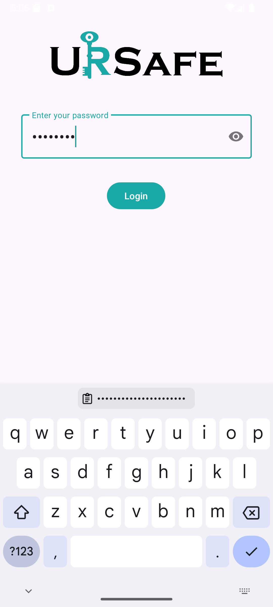
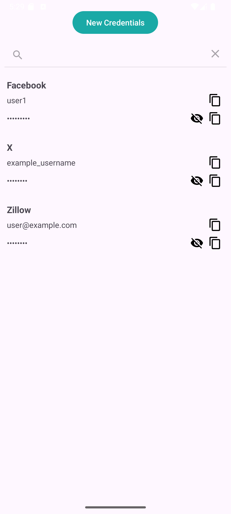
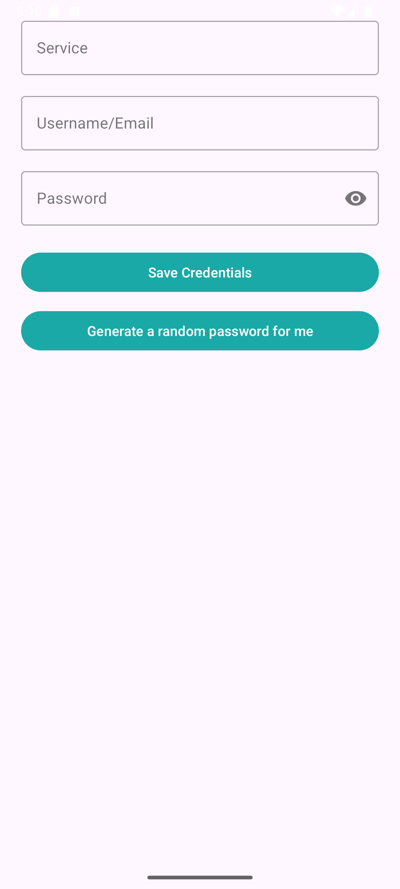
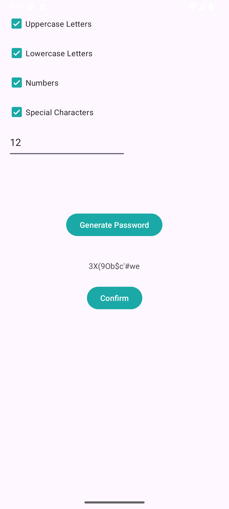

<p align="center">
  
</p>

<p align="center">
  <a href="https://choosealicense.com/licenses/mit/">
    
  </a>
  
  
</p>

URSafe is a secure, minimalistic password manager for Android. It allows you to store encrypted credentials, protect access with a master password, and generate strong passwords — all locally on your device.

---

## 🔐 Features

- 🔒 Master password login system with SHA-256 hashing
- 🔑 Secure credential storage using AES encryption
- 🔍 In-app search by service name
- 👁️ Toggle password visibility and copy with one tap
- 🔨 Password generator with customizable rules
- 🖌️ Clean, modern UI with branded logo and icons
- 🗂️ Swipe-to-delete with confirmation

---

## 🛠️ Tech Stack

- **Kotlin + Android Jetpack**
- **Room** for local encrypted database
- **LiveData** and **ViewModel** for reactive UI
- **EncryptedSharedPreferences** + AES/CBC for sensitive data
- **Material Components** for modern UI styling

---

## 📦 Build & Run Instructions

1. **Clone the repository**:
   ```bash
   git clone https://github.com/austinelliott9/ursafe.git
   cd ursafe
   ```

2. **Open in Android Studio**  
   File → Open → Choose the project root directory

3. **Build the app**:
   - From the IDE: `Build > Make Project`
   - Or from terminal:
     ```bash
     ./gradlew assembleDebug
     ```

4. **Run on emulator or device**:
   ```bash
   ./gradlew installDebug
   ```

---

## 📸 Screenshots

<table align="center">
  <tr>
    <td><b>Login Screen</b></td>
    <td><b>Credential List</b></td>
  </tr>
  <tr>
    <td></td>
    <td></td>
  </tr>
  <tr>
    <td><b>Add Credential</b></td>
    <td><b>Password Generator</b></td>
  </tr>
  <tr>
    <td></td>
    <td></td>
  </tr>
</table>

---

## ⚖️ License

This project is open source and available under the [MIT License](LICENSE).
